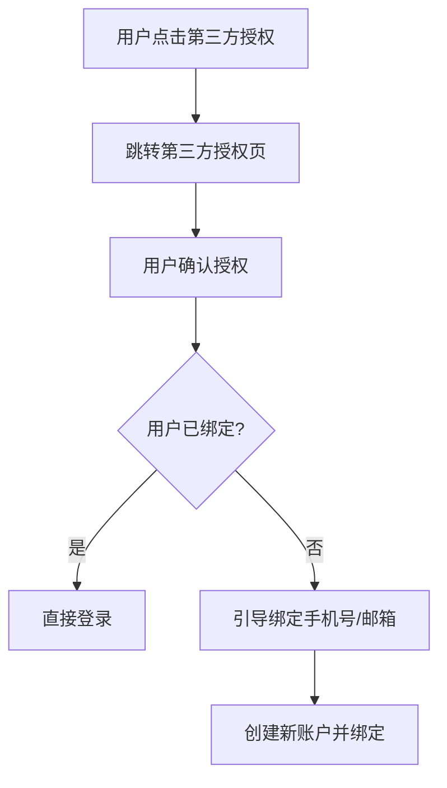

# 全平台通用用户认证设计规范

| 版本 | 日期 | 作者 | 更新说明 |
|------|------|------|----------|
| v1.0.0 | 2026-01-30 | CYP | 初始编制 |
| v1.0.1 | 2026-XX-XX | CYP | 新增忘记密码流程规范 |
| v1.0.2 | 2026-01-31 | CYP | 新增恶意行为检测与永久封禁规范 |

---

## 目录

- [一、概述](#一概述)
- [二、注册功能设计规范](#二注册功能设计规范)
- [三、登录功能设计规范](#三登录功能设计规范)
- [四、忘记密码功能设计规范](#四忘记密码功能设计规范)
- [五、界面设计规范](#五界面设计规范)
- [六、API接口设计规范](#六api接口设计规范)
- [七、安全设计规范](#七安全设计规范)
- [八、可访问性设计规范](#八可访问性设计规范)
- [九、多语言与本地化](#九多语言与本地化)
- [十、测试规范](#十测试规范)
- [十一、部署与运维](#十一部署与运维)
- [十二、统一验证码控制器规范](#十二统一验证码控制器规范)
- [附录一：相关规范参考](#附录一相关规范参考)
- [附录二：变更记录](#附录二变更记录)

## 一、概述

### 1.1 目的与范围

本规范旨在为全平台项目提供统一的用户认证设计标准，涵盖**注册、登录、忘记密码**三大核心功能模块。通过制定统一的交互流程、界面设计、接口规范和安全机制，确保用户认证功能的一致性、安全性和良好体验。

**适用范围**：全平台所有涉及用户认证的前端、后端、移动端项目。

### 1.2 核心原则

| 原则 | 说明 |
|------|------|
| **安全性优先** | 所有认证流程必须符合安全规范，防止暴力破解、Token泄露等风险 |
| **用户体验** | 流程简洁直观，减少用户操作步骤，支持多种认证方式 |
| **可扩展性** | 设计需支持未来扩展新认证方式（指纹、人脸等） |
| **合规性** | 符合《个人信息保护法》《网络安全法》等法规要求 |

---

## 二、注册功能设计规范

### 2.1 注册方式

#### 2.1.1 支持的注册方式

| 注册方式 | 说明 | 优先级 |
|----------|------|--------|
| **手机号+验证码** | 国内首选，用户体验最佳 | ⭐⭐⭐⭐⭐ |
| **邮箱+验证码** | 国际通用，适用海外场景 | ⭐⭐⭐⭐ |
| **邮箱+密码** | 传统方式，需密码强度校验 | ⭐⭐⭐ |
| **第三方账号授权** | 微信、Github、Google等 | ⭐⭐⭐⭐⭐ |

#### 2.1.2 第三方授权注册



**支持列表**：
- **国内平台**：微信（微信开放平台）、支付宝、QQ
- **国际平台**：Github、Google、Microsoft、Apple

### 2.2 注册流程

#### 2.2.1 手机号注册流程

```
┌─────────────────────────────────────────────────────────────────┐
│  步骤1: 输入手机号                                                │
│  ┌──────────────┐                                               │
│  │ +86 📱 手机号 │  [获取验证码]                                  │
│  └──────────────┘                                               │
│         ↓                                                       │
│  步骤2: 输入验证码                                                │
│  ┌──────────────┐                                               │
│  │ 🔢 验证码    │  [60s后可重新发送]                              │
│  └──────────────┘                                               │
│         ↓                                                       │
│  步骤3: 设置密码                                                  │
│  ┌──────────────┐                                               │
│  🔒 密码        │                                               │
│  🔒 确认密码    │                                               │
│  └──────────────┘                                               │
│         ↓                                                       │
│  步骤4: 注册成功                                                  │
│  ┌──────────────┐                                               │
│  │ ✅ 注册成功  │  [自动登录/跳转首页]                            │
│  └──────────────┘                                               │
└─────────────────────────────────────────────────────────────────┘
```

#### 2.2.2 邮箱注册流程

```
┌─────────────────────────────────────────────────────────────────┐
│  步骤1: 输入邮箱                                                  │
│  ┌──────────────┐                                               │
│  │ 📧 邮箱地址  │  [发送验证邮件]                                 │
│  └──────────────┘                                               │
│         ↓                                                       │
│  步骤2: 验证邮件                                                 │
│  ┌──────────────┐                                               │
│  │ 请前往邮箱确认 │  [链接有效期24小时]                            │
│  └──────────────┘                                               │
│         ↓                                                       │
│  步骤3: 设置密码                                                  │
│  ┌──────────────┐                                               │
│  🔒 密码        │                                               │
│  🔒 确认密码    │                                               │
│  └──────────────┘                                               │
│         ↓                                                       │
│  步骤4: 注册成功                                                  │
│  ┌──────────────┐                                               │
│  │ ✅ 注册成功  │  [自动登录/跳转首页]                            │
│  └──────────────┘                                               │
└─────────────────────────────────────────────────────────────────┘
```

### 2.3 表单验证规则

#### 2.3.1 输入校验

| 字段 | 校验规则 | 错误提示 |
|------|----------|----------|
| **手机号** | 11位数字，以1开头 | 请输入正确的手机号 |
| **邮箱** | 标准邮箱格式 | 请输入正确的邮箱地址 |
| **密码** | 8-20位，包含字母+数字，可含特殊字符 | 密码需包含字母和数字 |
| **确认密码** | 与密码一致 | 两次输入密码不一致 |

#### 2.3.2 密码强度指示器

```
密码强度: [弱] ●○○○○ [中] ●●○○○ [强] ●●●●○○
          红色      黄色      绿色
```

**密码强度标准**：
| 等级 | 要求 | 示例 |
|------|------|------|
| **弱** | 仅数字或仅字母，< 8位 | 12345678 |
| **中** | 字母+数字，8-12位 | abc123456 |
| **强** | 字母+数字+特殊字符，12-20位 | Abc123!@# |

### 2.4 注册限制

| 限制项 | 规则 |
|--------|------|
| **频率限制** | 单IP每分钟最多发起3次注册请求 |
| **手机号限制** | 每个手机号最多绑定3个账户 |
| **设备限制** | 单设备24小时内最多注册5个账户 |
| **邀请码** | 如需邀请注册，需验证邀请码有效性 |

### 2.5 注册后个人令牌生成规范

#### 2.5.1 令牌生成时机

用户在完成注册流程（验证通过并设置密码）后，系统将**自动生成唯一个人令牌**，无需用户手动申请。

```
┌─────────────────────────────────────────────────────────────────┐
│  注册成功                                                        │
│  ┌───────────────────────────────────────────────────────────┐  │
│  │                                                           │  │
│  │              ✅ 注册成功，已为您生成个人令牌                │  │
│  │                                                           │  │
│  │    ┌─────────────────────────────────────────────────┐    │  │
│  │    │                                                 │    │  │
│  │    │    个人令牌（Personal Access Token）             │    │  │
│  │    │    ─────────────────────────────────────────    │    │  │
│  │    │    pat_xxxxxxxxxxxxxxxxxxxxxxxxxxxxxxxx          │    │  │
│  │    │                                                 │    │  │
│  │    │    ⚠️ 请立即复制并妥善保管                         │  │
│  │    │    此令牌仅显示一次，无法再次查看                   │    │  │
│  │    │                                                 │    │  │
│  │    └─────────────────────────────────────────────────┘    │  │
│  │                                                           │  │
│  │    [复制令牌]  [我已妥善保管]  [跳过，稍后在账户设置查看]   │  │
│  │                                                           │  │
│  └───────────────────────────────────────────────────────────┘  │
└─────────────────────────────────────────────────────────────────┘
```

#### 2.5.2 令牌特性

| 特性 | 说明 |
|------|------|
| **自动生成** | 注册完成后立即自动生成，无需用户操作 |
| **全局唯一** | 基于UUID v4生成，确保全球唯一性 |
| **不可重置** | **令牌一旦生成，无法重置或更新** |
| **不可修改** | 令牌内容固定，生成后不可更改 |
| **一次性展示** | 仅在注册成功时显示一次，后续无法再次查看完整令牌 |
| **永久有效** | 除非用户主动删除，否则永不过期 |

#### 2.5.3 令牌格式规范

**标准格式**：
```
pat_{prefix}_{uuid_without_hyphens}
```

**示例**：
```
pat_v1_a1b2c3d4e5f6g7h8i9j0k1l2m3n4o5p6
```

**格式说明**：
| 组成部分 | 说明 |
|----------|------|
| `pat_` | 前缀，标识为Personal Access Token |
| `v1` | 版本号，支持未来格式升级 |
| `a1b2c3...` | 32位十六进制字符串（UUID v4无连字符） |

**技术实现**：
```python
import uuid

def generate_personal_token():
    """生成个人访问令牌"""
    token_id = uuid.uuid4()  # UUID v4
    token_str = f"pat_v1_{token_id.hex}"
    return token_str

# 示例输出: pat_v1_a1b2c3d4e5f6g7h8i9j0k1l2m3n4o5p6
```

#### 2.5.4 令牌用途

| 用途场景 | 说明 |
|----------|------|
| **API认证** | 用于调用个人相关的API接口 |
| **CLI工具认证** | 命令行工具身份验证 |
| **第三方集成** | 外部系统访问用户数据 |
| **自动化脚本** | 脚本中的身份认证 |

#### 2.5.5 令牌安全管理

| 管理项 | 规则 |
|--------|------|
| **存储** | 后端仅存储bcrypt哈希值，不存储原始令牌 |
| **展示** | 仅在注册成功时展示一次，后续仅显示掩码 `pat_v1_**** **** **** ****` |
| **删除** | 用户可在账户设置中删除令牌 |
| **生成新令牌** | 如需新令牌，需删除旧令牌后重新生成 |
| **不可重置** | **不支持令牌重置功能，旧令牌删除后需生成全新令牌** |

#### 2.5.6 令牌查看与管理

**账户设置页面**：
```
┌─────────────────────────────────────────────────────────────────┐
│  个人令牌管理                                                    │
│                                                                 │
│  ┌─────────────────────────────────────────────────────────┐   │
│  │  个人令牌（Personal Access Token）     [+ 生成新令牌]    │   │
│  ├─────────────────────────────────────────────────────────┤   │
│  │                                                         │   │
│  │  pat_v1_a1b2 **** **** **** **** **** **** **** ****   │   │
│  │  创建于：2026-01-30 10:30:45                            │   │
│  │  最后使用：2026-01-30 14:22:18                          │   │
│  │                                        [复制] [删除]    │   │
│  │                                                         │   │
│  └─────────────────────────────────────────────────────────┘   │
│                                                                 │
│  ⚠️ 注意：令牌仅在创建时显示一次，删除后无法恢复                 │
│                                                                 │
└─────────────────────────────────────────────────────────────────┘
```

**操作规则**：
| 操作 | 规则 |
|------|------|
| **查看** | 仅显示掩码，完整令牌仅在创建时展示 |
| **复制** | 点击复制按钮复制完整令牌 |
| **删除** | 需二次确认，删除后立即失效 |
| **重新生成** | 删除旧令牌后方可生成新令牌 |

#### 2.5.7 API接口设计

**注册返回令牌**：

```http
POST /api/v1/auth/register
Content-Type: application/json

{
  "type": "sms",
  "target": "13888888888",
  "code": "123456",
  "password": "Abc123!@#"
}
```

**响应**：
```json
{
  "code": 0,
  "message": "注册成功",
  "data": {
    "user_id": "usr_abc123",
    "personal_token": "pat_v1_a1b2c3d4e5f6g7h8i9j0k1l2m3n4o5p6",
    "personal_token_displayed": true,
    "token": {
      "access_token": "eyJ...",
      "refresh_token": "def...",
      "expires_in": 7200
    }
  }
}
```

**响应字段说明**：
| 字段 | 类型 | 说明 |
|------|------|------|
| personal_token | string | 完整个人令牌（仅注册时返回） |
| personal_token_displayed | boolean | 标识令牌已向用户展示（用于前端判断） |

**查询令牌列表**（仅返回掩码）：
```http
GET /api/v1/user/tokens
```

**响应**：
```json
{
  "code": 0,
  "data": {
    "tokens": [
      {
        "id": "tok_abc123",
        "masked_token": "pat_v1_a1b2 **** **** **** **** **** **** ****",
        "created_at": "2026-01-30T10:30:45Z",
        "last_used_at": "2026-01-30T14:22:18Z",
        "status": "active"
      }
    ]
  }
}
```

**删除令牌**：
```http
DELETE /api/v1/user/tokens/{token_id}
```

**重新生成令牌**（先删除后创建）：
```http
POST /api/v1/user/tokens
```

---

## 三、登录功能设计规范

### 3.1 登录方式

#### 3.1.1 支持的登录方式

| 登录方式 | 说明 | 优先级 |
|----------|------|--------|
| **账号+密码** | 传统方式，支持手机号/邮箱/用户名 | ⭐⭐⭐⭐⭐ |
| **手机号+验证码** | 免记忆密码，更安全 | ⭐⭐⭐⭐⭐ |
| **第三方授权** | 一键登录，体验最佳 | ⭐⭐⭐⭐ |

#### 3.1.2 登录方式切换

```
┌────────────────────────────────────────────────────────┐
│  [手机号登录]  [邮箱/用户名登录]  [二维码登录]            │
│  ───────────────────────────────────────────────────── │
│                                                        │
│  ┌──────────────────────────────────────────────────┐ │
│  │                                                  │ │
│  │           第三方账号快速登录                      │ │
│  │    [微信] [QQ] [Github] [Google]                │ │
│  │                                                  │ │
│  └──────────────────────────────────────────────────┘ │
│                                                        │
└────────────────────────────────────────────────────────┘
```

### 3.2 登录流程

#### 3.2.1 密码登录流程

```
┌─────────────────────────────────────────────────────────────────┐
│  登录页面                                                        │
│  ┌─────────────────────────────────────────────────────────┐   │
│  │  📱 手机号 / 📧 邮箱 / 👤 用户名                         │   │
│  └─────────────────────────────────────────────────────────┘   │
│  ┌─────────────────────────────────────────────────────────┐   │
│  │  🔒 密码                                                │   │
│  └─────────────────────────────────────────────────────────┘   │
│  ┌─────────────────────────────────────────────────────────┐   │
│  │  ☐ 记住我        [忘记密码?]                            │   │
│  └─────────────────────────────────────────────────────────┘   │
│  ┌─────────────────────────────────────────────────────────┐   │
│  │                    [登 录]                               │   │
│  └─────────────────────────────────────────────────────────┘   │
└─────────────────────────────────────────────────────────────────┘
```

#### 3.2.2 验证码登录流程

```
┌─────────────────────────────────────────────────────────────────┐
│  验证码登录页面                                                   │
│  ┌─────────────────────────────────────────────────────────┐   │
│  │  📱 手机号                                               │   │
│  └─────────────────────────────────────────────────────────┘   │
│  ┌─────────────────────────────────────────────────────────┐   │
│  │  🔢 验证码     [获取验证码]                              │   │
│  └─────────────────────────────────────────────────────────┘   │
│  ┌─────────────────────────────────────────────────────────┐   │
│  │                    [登 录]                               │   │
│  └─────────────────────────────────────────────────────────┘   │
└─────────────────────────────────────────────────────────────────┘
```

### 3.3 登录安全机制

#### 3.3.1 暴力破解防护

| 防护措施 | 具体实现 |
|----------|----------|
| **登录失败次数限制** | 同一账号连续失败5次，锁定15分钟 |
| **验证码要求** | 连续失败3次后，强制输入图形验证码 |
| **IP封禁** | 同一IP 1小时内失败50次，封禁24小时 |
| **登录间隔限制** | 最小登录间隔5秒 |

#### 3.3.2 异常登录检测

| 检测场景 | 响应措施 |
|----------|----------|
| **异地登录** | 发送登录通知，要求二次验证 |
| **新设备登录** | 发送设备验证邮件/短信 |
| **频繁切换IP** | 触发风控，限制敏感操作 |
| **非工作时间登录** | 可配置告警通知 |

#### 3.3.3 多因素认证（MFA）

**可选认证方式**：
| 方式 | 安全性 | 体验 | 适用场景 |
|------|--------|------|----------|
| **短信验证码** | ⭐⭐⭐ | ⭐⭐⭐⭐ | 通用场景 |
| **邮件验证码** | ⭐⭐⭐ | ⭐⭐⭐ | 低频操作 |
| **TOTP动态口令** | ⭐⭐⭐⭐⭐ | ⭐⭐⭐ | 高安全场景 |
| **硬件令牌** | ⭐⭐⭐⭐⭐ | ⭐⭐ | 企业级场景 |

### 3.4 登录状态管理

#### 3.4.1 Token机制

```json
{
  "access_token": "eyJhbGciOiJIUzI1NiIsInR5cCI6IkpXVCJ9...",
  "refresh_token": "def50200e4f1a8d7e8...",
  "expires_in": 7200,
  "token_type": "Bearer"
}
```

**Token配置**：
| Token类型 | 有效期 | 用途 |
|-----------|--------|------|
| **Access Token** | 2小时 | API请求认证 |
| **Refresh Token** | 7天 | 刷新Access Token |
| **Remember Me Token** | 30天 | 免登录状态 |

#### 3.4.2 Session管理

| 场景 | 处理方式 |
|------|----------|
| **单设备登录** | 新登录踢掉旧会话 |
| **多设备登录** | 允许最多5个并发会话 |
| **用户主动登出** | 清除所有本地Token |
| **密码修改** | 强制所有设备重新认证 |

### 3.5 登录日志

**记录内容**：
| 字段 | 说明 |
|------|------|
| 用户ID | 登录用户唯一标识 |
| 登录时间 | 精确到秒 |
| 登录IP | 客户端IP地址 |
| 设备信息 | 浏览器/操作系统/设备型号 |
| 登录方式 | 密码/验证码/第三方 |
| 登录结果 | 成功/失败及原因 |
| 地理位置 | 根据IP解析 |

**用户可查看**：近30天登录记录

---

## 四、忘记密码功能设计规范

### 4.1 密码找回流程

#### 4.1.1 流程概述

```
┌─────────────────────────────────────────────────────────────────┐
│                    忘记密码流程                                   │
│                                                                 │
│  选择验证方式 ──→ 身份验证 ──→ 设置新密码 ──→ 完成重置           │
│      ↓               ↓              ↓               ↓            │
│  手机/邮箱       验证码验证      密码强度校验     重置成功提示     │
│                                    ↓                            │
│                              自动跳转登录                         │
│                                                                 │
└─────────────────────────────────────────────────────────────────┘
```

#### 4.1.2 步骤详解

**步骤1：选择验证方式**

```
┌─────────────────────────────────────────────────────────────────┐
│  忘记密码                                                        │
│                                                                 │
│  请选择验证方式：                                                 │
│                                                                 │
│  ┌───────────────────────────────────────────────────────────┐  │
│  │  📱 通过手机号验证                                          │  │
│  │     已绑定：138****8888                                    │  │
│  └───────────────────────────────────────────────────────────┘  │
│                                                                 │
│  ┌───────────────────────────────────────────────────────────┐  │
│  │  📧 通过邮箱验证                                            │  │
│  │     已绑定：u***@example.com                               │  │
│  └───────────────────────────────────────────────────────────┘  │
│                                                                 │
│  ┌───────────────────────────────────────────────────────────┐  │
│  │  ❓ 忘记手机号和邮箱?                                       │  │
│  │     [联系客服处理]                                          │  │
│  └───────────────────────────────────────────────────────────┘  │
└─────────────────────────────────────────────────────────────────┘
```

**步骤2：身份验证**

```
┌─────────────────────────────────────────────────────────────────┐
│  身份验证                                                        │
│                                                                 │
│  已发送验证码至：138****8888                                     │
│                                                                 │
│  ┌─────────────────────────────────────────────────────────┐   │
│  │  🔢 请输入验证码     [60s] [重新发送]                     │   │
│  └─────────────────────────────────────────────────────────┘   │
│                                                                 │
│  ┌─────────────────────────────────────────────────────────┐   │
│  │                      [下一步]                             │   │
│  └─────────────────────────────────────────────────────────┘   │
└─────────────────────────────────────────────────────────────────┘
```

**步骤3：设置新密码**

```
┌─────────────────────────────────────────────────────────────────┐
│  设置新密码                                                      │
│                                                                 │
│  ┌─────────────────────────────────────────────────────────┐   │
│  │  🔒 新密码                                                │   │
│  │     密码强度：[弱] ●○○○○                                 │   │
│  └─────────────────────────────────────────────────────────┘   │
│                                                                 │
│  ┌─────────────────────────────────────────────────────────┐   │
│  │  🔒 确认新密码                                            │   │
│  └─────────────────────────────────────────────────────────┘   │
│                                                                 │
│  ⚠️ 提示：密码不能与最近3次使用的密码相同                        │
│                                                                 │
│  ┌─────────────────────────────────────────────────────────┐   │
│  │                    [确认重置]                             │   │
│  └─────────────────────────────────────────────────────────┘   │
└─────────────────────────────────────────────────────────────────┘
```

**步骤4：重置成功**

```
┌─────────────────────────────────────────────────────────────────┐
│  密码重置成功 🎉                                                 │
│                                                                 │
│  ┌─────────────────────────────────────────────────────────┐   │
│  │           ✅ 您的密码已成功重置                           │   │
│  │                                                             │   │
│  │           新密码已生效，请使用新密码登录                    │   │
│  └─────────────────────────────────────────────────────────┘   │
│                                                                 │
│  ┌─────────────────────────────────────────────────────────┐   │
│  │                    [返回登录]                             │   │
│  └─────────────────────────────────────────────────────────┘   │
│                                                                 │
│  📧 系统已发送密码重置通知至您的邮箱                             │
└─────────────────────────────────────────────────────────────────┘
```

### 4.2 验证码规则

| 规则 | 参数 |
|------|------|
| **验证码长度** | 6位数字 |
| **有效期** | 5分钟 |
| **发送间隔** | 60秒（可重新发送） |
| **最大尝试次数** | 5次（错误后需重新获取） |
| **每日上限** | 单手机号/邮箱最多发送10次 |

### 4.3 重置链接/验证码有效期

| 方式 | 有效期 | 说明 |
|------|--------|------|
| **短信验证码** | 5分钟 | 一次性使用 |
| **邮箱重置链接** | 24小时 | 点击后失效 |
| **重置Token** | 1次有效 | 完成重置后失效 |

### 4.4 密码重置安全限制

| 限制项 | 规则 |
|--------|------|
| **频率限制** | 同一账号每天最多发起5次密码重置请求 |
| **IP限制** | 同一IP每小时最多发起20次重置请求 |
| **历史密码检查** | 不能使用最近3次使用过的密码 |
| **设备绑定** | 重置请求与发起设备绑定 |

### 4.5 重置后处理

| 处理项 | 说明 |
|--------|------|
| **Token失效** | 强制所有已登录设备下线 |
| **会话清除** | 清除所有活跃会话 |
| **通知用户** | 发送密码重置成功通知 |
| **安全日志** | 记录密码重置操作日志 |

---

## 五、界面设计规范

### 5.1 登录/注册页面布局

#### 5.1.1 移动端布局

```
┌─────────────────────────────────────────┐
│  ┌─────────────────────────────────┐    │
│  │                                 │    │
│  │      欢迎回来                   │    │
│  │      Login to continue          │    │
│  │                                 │    │
│  ├─────────────────────────────────┤    │
│  │  📱 +86 [输入手机号]            │    │
│  ├─────────────────────────────────┤    │
│  │  🔒 [输入密码]                  │    │
│  ├─────────────────────────────────┤    │
│  │  ☐ 记住我      [忘记密码?]      │    │
│  ├─────────────────────────────────┤    │
│  │                                 │    │
│  │     [ 登 录 ]                   │    │
│  │                                 │    │
│  ├─────────────────────────────────┤    │
│  │  社交账号登录                   │    │
│  │    [微信] [Apple]               │    │
│  ├─────────────────────────────────┤    │
│  │  还没有账号? [立即注册]          │    │
│  └─────────────────────────────────┘    │
└─────────────────────────────────────────┘
```

#### 5.1.2 PC端布局

```
┌─────────────────────────────────────────────────────────────┐
│                                                             │
│      ┌─────────────────────────────────────────────────┐    │
│      │                                                 │    │
│      │         LOGO / 产品名称                          │    │
│      │                                                 │    │
│      ├─────────────────────────────────────────────────┤    │
│      │                                                 │    │
│      │  欢迎登录                                        │    │
│      │  Sign in to your account                         │    │
│      │                                                 │    │
│      │  ┌─────────────────────────────────────────┐   │    │
│      │  │ 📧 邮箱 / 📱 手机号 / 👤 用户名          │   │    │
│      │  └─────────────────────────────────────────┘   │    │
│      │                                                 │    │
│      │  ┌─────────────────────────────────────────┐   │    │
│      │  │ 🔒 密码                                   │   │    │
│      │  └─────────────────────────────────────────┘   │    │
│      │                                                 │    │
│      │  ☐ 记住我          [忘记密码?]                │    │
│      │                                                 │    │
│      │  ┌─────────────────────────────────────────┐   │    │
│      │  │            [登 录]                       │   │    │
│      │  └─────────────────────────────────────────┘   │    │
│      │                                                 │    │
│      │  ─────────── 或 ───────────                   │    │
│      │                                                 │    │
│      │  第三方账号登录                                 │    │
│      │  [微信] [Github] [Google]                     │    │
│      │                                                 │    │
│      ├─────────────────────────────────────────────────┤    │
│      │  还没有账号? [立即注册]                         │    │
│      │                                                 │    │
│      └─────────────────────────────────────────────────┘    │
│                                                             │
│                     [切换语言] [帮助中心]                     │
└─────────────────────────────────────────────────────────────┘
```

### 5.2 组件设计规范

#### 5.2.1 输入框状态

| 状态 | 视觉表现 | 说明 |
|------|----------|------|
| **默认** | 灰色边框，浅灰背景 | 等待输入 |
| **聚焦** | 主题色边框，浅主题色背景 | 正在输入 |
| **填写完成** | 绿色边框 | 验证通过 |
| **错误** | 红色边框，红色错误提示 | 验证失败 |
| **禁用** | 灰色背景，不可点击 | 不可操作 |

#### 5.2.2 按钮状态

| 状态 | 样式 |
|------|------|
| **默认** | 主题色填充 |
| **hover** | 主题色加深10% |
| **active** | 主题色加深20% |
| **disabled** | 灰色填充，50%透明度 |
| **loading** | 加载动画，禁止点击 |

#### 5.2.3 验证码倒计时

```
[获取验证码] ──点击──→ [60s后重新获取] ──计时──→ [59s] [58s] ... [0s] ──完成──→ [重新获取]
```

### 5.3 错误提示规范

#### 5.3.1 错误提示位置

| 场景 | 提示位置 |
|------|----------|
| **单字段错误** | 输入框正下方 |
| **表单整体错误** | 表单顶部 |
| **全局错误** | 页面顶部固定显示 |
| **Toast提示** | 页面居中底部（3秒自动消失） |

#### 5.3.2 错误提示文案

| 场景 | 文案 |
|------|------|
| 手机号格式错误 | 请输入正确的手机号 |
| 邮箱格式错误 | 请输入正确的邮箱地址 |
| 密码错误 | 手机号或密码错误 |
| 验证码错误 | 验证码错误，请重新输入 |
| 账户被锁定 | 账户已锁定，请15分钟后重试 |
| 验证码已过期 | 验证码已过期，请重新获取 |
| 网络错误 | 网络连接异常，请检查网络 |

---

## 六、API接口设计规范

### 6.1 注册接口

#### 6.1.1 发送注册验证码

```http
POST /api/v1/auth/register/send-code
Content-Type: application/json

{
  "type": "sms",           // sms | email
  "target": "13888888888"  // 手机号或邮箱
}
```

**响应**：
```json
{
  "code": 0,
  "message": "success",
  "data": {
    "expires_in": 300
  }
}
```

#### 6.1.2 提交注册

```http
POST /api/v1/auth/register
Content-Type: application/json

{
  "type": "sms",           // sms | email | password
  "target": "13888888888",
  "code": "123456",        // 验证码或密码
  "password": "Abc123!@#", // 仅type为password时需要
  "device_info": {
    "platform": "web",
    "os": "Windows 11",
    "browser": "Chrome 120"
  }
}
```

**响应**：
```json
{
  "code": 0,
  "message": "注册成功",
  "data": {
    "user_id": "usr_abc123",
    "token": {
      "access_token": "eyJ...",
      "refresh_token": "def...",
      "expires_in": 7200
    }
  }
}
```

### 6.2 登录接口

#### 6.2.1 密码登录

```http
POST /api/v1/auth/login/password
Content-Type: application/json

{
  "account": "13888888888",  // 手机号/邮箱/用户名
  "password": "Abc123!@#",
  "remember": true,
  "captcha": "xyz123",       // 需要验证码时必填
  "device_info": { ... }
}
```

**响应**：
```json
{
  "code": 0,
  "message": "登录成功",
  "data": {
    "user_id": "usr_abc123",
    "need_mfa": false,       // 是否需要多因素认证
    "token": { ... },
    "login_warning": null    // 异地登录等警告信息
  }
}
```

#### 6.2.2 验证码登录

```http
POST /api/v1/auth/login/code
Content-Type: application/json

{
  "type": "sms",
  "target": "13888888888",
  "code": "123456",
  "device_info": { ... }
}
```

#### 6.2.3 第三方登录

```http
POST /api/v1/auth/login/oauth
Content-Type: application/json

{
  "provider": "wechat",     // wechat | github | google
  "oauth_code": "CODE_FROM_PROVIDER",
  "bind_if_exists": true,   // 账号已存在时是否自动绑定
  "device_info": { ... }
}
```

**响应**：
```json
{
  "code": 0,
  "message": "success",
  "data": {
    "is_new_user": true,
    "need_bind_phone": true,  // 新用户需要绑定手机号
    "token": { ... }
  }
}
```

### 6.3 忘记密码接口

#### 6.3.1 发送重置验证码

```http
POST /api/v1/auth/password/reset/send-code
Content-Type: application/json

{
  "type": "sms",
  "target": "13888888888"
}
```

#### 6.3.2 验证重置验证码

```http
POST /api/v1/auth/password/reset/verify
Content-Type: application/json

{
  "type": "sms",
  "target": "13888888888",
  "code": "123456"
}
```

**响应**：
```json
{
  "code": 0,
  "message": "验证成功",
  "data": {
    "reset_token": "rst_abc123xyz",  // 用于重置密码
    "expires_in": 900                // 15分钟有效
  }
}
```

#### 6.3.3 执行密码重置

```http
POST /api/v1/auth/password/reset
Content-Type: application/json

{
  "reset_token": "rst_abc123xyz",
  "new_password": "NewPwd123!@#"
}
```

### 6.4 错误码规范

| 错误码 | 说明 |
|--------|------|
| 30001 | 参数错误 |
| 30002 | 账户不存在 |
| 30003 | 密码错误 |
| 30004 | 验证码错误 |
| 30005 | 验证码已过期 |
| 30006 | 账户已锁定 |
| 30007 | 账户已禁用 |
| 30008 | Token无效 |
| 30009 | Token已过期 |
| 30010 | 需要多因素认证 |
| 30011 | 验证码发送过于频繁 |
| 30012 | 请求过于频繁 |
| 30013 | 账户已永久封禁 |

---

## 七、安全设计规范

### 7.1 传输安全

| 要求 | 说明 |
|------|------|
| **HTTPS强制** | 所有认证接口必须使用HTTPS |
| **证书固定** | 移动端建议使用证书固定 |
| **敏感字段加密** | 密码在传输前前端加密 |

### 7.2 存储安全

| 要求 | 说明 |
|------|------|
| **密码加密** | 使用bcrypt/Argon2算法，cost factor ≥ 12 |
| **Token存储** | HttpOnly Cookie或安全存储 |
| **日志脱敏** | 禁止记录密码、Token等敏感信息 |

### 7.3 业务安全

| 威胁 | 防护措施 |
|------|----------|
| **暴力破解** | 登录失败限制、验证码、IP封禁 |
| **撞库攻击** | 验证码、行为验证 |
| **重放攻击** | 请求签名、时间戳、nonce |
| **中间人攻击** | HTTPS强制、证书验证 |
| **Token泄露** | 短有效期、Refresh Token机制 |

### 7.4 安全审计日志

**必须记录的认证事件**：
| 事件 | 说明 |
|------|------|
| 登录成功/失败 | 记录时间、IP、设备、原因 |
| 密码修改 | 记录时间、IP |
| 密码重置 | 记录时间、IP、验证方式 |
| 账户锁定 | 记录时间、原因 |
| 权限变更 | 记录时间、操作人 |
| **封禁事件** | 记录封禁时间、原因、封禁对象 |

### 7.5 恶意行为检测与永久封禁规范

#### 7.5.1 恶意行为定义与分类

| 行为类型 | 定义 | 典型特征 |
|----------|------|----------|
| **暴力破解** | 短时间内对同一账号进行大量密码尝试 | 同一账号1分钟内失败≥10次；单IP 1小时内失败≥50次 |
| **批量验证** | 使用大量不同账号批量验证凭证有效性 | 单IP 1小时内尝试不同账号≥100个 |
| **批量注册** | 使用自动化工具批量创建账号 | 单IP 1小时内注册≥10个账号；单设备24小时注册≥20个账号 |
| **批量重置** | 批量发起密码重置请求 | 单IP 1小时内重置请求≥50次 |

#### 7.5.2 封禁级别与规则

**一级封禁（临时封禁）- 24小时**
| 触发条件 | 封禁内容 | 解封方式 |
|----------|----------|----------|
| 同一账号1分钟内登录失败≥10次 | 账号禁止登录24小时 | 24小时后自动解封 |
| 单IP 1小时内登录失败≥30次 | IP禁止访问登录接口24小时 | 24小时后自动解封 |
| 单IP 1小时内发起注册请求≥10次 | IP禁止访问注册接口24小时 | 24小时后自动解封 |

**二级封禁（永久封禁） - 永不解封**
| 触发条件 | 封禁内容 | 备注 |
|----------|----------|------|
| **暴力破解** | 单账号累计被暴力破解≥3次 | 无论累计时间，均永久封禁 |
| **暴力破解** | 单IP累计暴力破解攻击≥5次 | 关联该IP下所有账号 |
| **批量验证** | 单IP 1小时内验证不同账号≥100个 | 永久封禁IP及设备 |
| **批量验证** | 使用自动化工具特征明显 | 永久封禁IP及设备 |
| **批量注册** | 单IP累计批量注册≥3次 | 永久封禁IP及关联设备 |
| **批量注册** | 单设备累计批量注册≥5个账号 | 永久封禁设备及关联账号 |
| **批量重置** | 单IP累计批量重置攻击≥3次 | 永久封禁IP及关联账号 |
| **批量重置** | 批量重置成功后尝试登录失败≥50次 | 永久封禁相关账号 |

#### 7.5.3 检测机制

**实时检测指标**：
| 监控项 | 阈值 | 响应 |
|--------|------|------|
| 单账号登录失败频率 | ≥10次/分钟 | 触发一级封禁 |
| 单IP登录失败频率 | ≥30次/分钟 | 触发一级封禁 |
| 单IP注册请求频率 | ≥10次/小时 | 触发一级封禁 |
| 单IP验证账号数量 | ≥100个/小时 | 触发二级封禁 |
| 单IP密码重置频率 | ≥50次/小时 | 触发一级封禁 |

**行为特征识别**：
```python
from datetime import timedelta

# 暴力破解检测示例
def detect_brute_force(account, ip, failure_count, time_window):
    """
    暴力破解检测
    """
    # 同一账号短时间内大量失败
    if failure_count >= 10 and time_window <= timedelta(minutes=1):
        return {"type": "brute_force", "level": 1}

    # 累计触发3次暴力破解
    if get_brute_force_history(account) >= 3:
        return {"type": "brute_force", "level": 2, "permanent": True}

# 批量注册检测示例
def detect_batch_registration(ip, device_fingerprint, count, time_window):
    """
    批量注册检测
    """
    # 单IP大量注册
    if count >= 10 and time_window <= timedelta(hours=1):
        return {"type": "batch_registration", "level": 2, "permanent": True}

    # 单设备大量注册
    if get_device_registration_count(device_fingerprint) >= 20:
        return {"type": "batch_registration", "level": 2, "permanent": True}
```

#### 7.5.4 封禁执行规则

**封禁对象**：
| 封禁对象 | 说明 |
|----------|------|
| **账号封禁** | 用户无法登录、无法进行任何认证操作 |
| **IP封禁** | 该IP无法访问所有认证相关接口 |
| **设备封禁** | 该设备指纹无法发起认证请求 |
| **关联封禁** | 封禁IP关联的所有账号和设备 |

**封禁处理流程**：
```
检测到恶意行为
      ↓
判断封禁级别
      ↓
┌─────────────────────────────────────┐
│         一级封禁                     │
│  - 记录封禁日志                      │
│  - 封禁24小时                        │
│  - 发送告警通知                      │
│  - 24小时后自动解封                  │
└─────────────────────────────────────┘
      ↓
┌─────────────────────────────────────┐
│         二级封禁                     │
│  - 记录封禁日志                      │
│  - 永久封禁（永不自动解封）           │
│  - 发送严重告警通知                  │
│  - 标记为恶意用户                    │
│  - 人工审核后可解封                  │
└─────────────────────────────────────┘
```

#### 7.5.5 解封规则

**一级封禁**：
- 自动解封：24小时后自动解除
- 手动解封：用户可申请人工审核后提前解封

**二级封禁（永久封禁）**：
- **永不自动解封**
- 手动解封条件：
  1. 用户主动申请解封
  2. 提供身份证明材料
  3. 人工审核通过
  4. 解封后增加额外安全验证（如强制MFA）
- 记录所有手动解封操作及审批人

#### 7.5.6 告警与通知

**封禁告警**：
| 事件 | 告警级别 | 通知对象 |
|------|----------|----------|
| 一级封禁触发 | 低 | 系统日志 |
| 二级封禁触发 | 高 | 安全管理员、运维人员 |
| 批量攻击检测 | 严重 | 安全管理员、运维负责人 |
| 封禁率异常上升 | 高 | 安全管理员 |

**用户通知**：
| 封禁类型 | 通知内容 |
|----------|----------|
| 账号一级封禁 | "由于检测到异常登录行为，您的账号已被锁定24小时。如有疑问，请联系客服。" |
| 账号二级封禁 | "由于检测到恶意行为，您的账号已被永久封禁。如需申诉，请联系客服并提供身份证明。" |
| IP封禁 | "检测到来自您网络的异常请求，请联系网络管理员或尝试更换网络环境。" |

#### 7.5.7 封禁记录与审计

**必须记录的封禁事件**：
| 字段 | 说明 |
|------|------|
| 封禁ID | 唯一标识 |
| 封禁类型 | 账号/IP/设备/关联 |
| 封禁级别 | 一级/二级 |
| 触发原因 | 具体行为类型 |
| 封禁对象 | 被封禁的账号/IP/设备 |
| 封禁时间 | 精确到秒 |
| 解封时间 | 永久封禁为NULL |
| 解封方式 | 自动/手动/申诉 |
| 操作人 | 手动解封时的操作人 |

**封禁查询接口**：
```http
GET /api/v1/admin/security/bans
```

```json
{
  "code": 0,
  "data": {
    "bans": [
      {
        "id": "ban_abc123",
        "type": "account",
        "target": "usr_xyz789",
        "level": 2,
        "reason": "暴力破解累计3次",
        "banned_at": "2026-01-31T10:30:00Z",
        "unbanned_at": null,
        "unban_reason": null
      }
    ]
  }
}
```

**手动解封接口**：
```http
POST /api/v1/admin/security/bans/{ban_id}/unban
{
  "reason": "用户已提交身份证明，审核通过",
  "require_mfa": true
}
```

#### 7.5.8 配置项

| 配置项 | 说明 | 默认值 |
|--------|------|--------|
| BRUTE_FORCE_THRESHOLD | 暴力破解检测阈值（次/分钟） | 10 |
| BRUTE_FORCE_MAX_HISTORY | 累计暴力破解次数上限 | 3 |
| BATCH_VERIFY_THRESHOLD | 批量验证检测阈值（账号数/小时） | 100 |
| BATCH_REGISTER_THRESHOLD | 批量注册检测阈值（次/小时） | 10 |
| BATCH_RESET_THRESHOLD | 批量重置检测阈值（次/小时） | 50 |
| LEVEL1_BAN_DURATION | 一级封禁时长（小时） | 24 |
| ENABLE_PERMANENT_BAN | 是否启用永久封禁 | true |
| AUTO_UNBAN_ENABLED | 一级封禁是否自动解封 | true |

---

## 八、可访问性设计规范

### 8.1 键盘导航

| 要求 | 说明 |
|------|------|
| **Tab顺序** | 按逻辑顺序排列，可通过键盘完成全部操作 |
| **焦点指示** | 明确显示当前焦点位置 |
| **快捷键** | 支持Enter登录，Esc关闭弹窗 |

### 8.2 屏幕阅读器支持

| 要求 | 说明 |
|------|------|
| **ARIA标签** | 为输入框、按钮添加标签 |
| **错误提示关联** | 错误信息与输入框关联 |
| **状态提示** | 加载状态、错误状态可被朗读 |

### 8.3 对比度与字体

| 要求 | 说明 |
|------|------|
| **文字对比度** | WCAG AA级（4.5:1） |
| **字体大小** | 最小14px |
| **可缩放** | 支持200%放大 |

---

## 九、多语言与本地化

### 9.1 支持语言

| 语言 | 代码 | 优先级 |
|------|------|--------|
| 简体中文 | zh-CN | ⭐⭐⭐⭐⭐ |
| 英文 | en | ⭐⭐⭐⭐⭐ |
| 繁体中文 | zh-TW | ⭐⭐⭐ |
| 日文 | ja | ⭐⭐⭐ |
| 韩文 | ko | ⭐⭐⭐ |

### 9.2 需要翻译的内容

| 内容 | 示例 |
|------|------|
| 页面标题 | 登录、注册、忘记密码 |
| 按钮文字 | 登 录、注 册、获取验证码 |
| 占位提示 | 请输入手机号、请输入密码 |
| 错误提示 | 手机号格式错误、密码错误 |
| 成功提示 | 登录成功、注册成功 |
| 帮助文字 | 还没有账号？立即注册 |

---

## 十、测试规范

### 10.1 测试用例

| 测试类型 | 测试点 |
|----------|--------|
| **功能测试** | 各登录方式、注册流程、密码重置流程 |
| **边界测试** | 最大/最小长度、特殊字符、边界值 |
| **异常测试** | 网络中断、服务超时、并发登录 |
| **安全测试** | SQL注入、XSS、暴力破解、批量攻击 |
| **兼容性测试** | 各浏览器、各系统、各机型 |
| **性能测试** | 登录响应时间、并发用户数 |

### 10.2 测试账号

| 用途 | 账号 | 密码 |
|------|------|------|
| 正常登录测试 | test@example.com | Test123!@# |
| 锁定账号测试 | locked@example.com | Test123!@# |
| 未注册账号测试 | notexist@example.com | Test123!@# |
| 封禁账号测试 | banned@example.com | Test123!@# |

### 10.3 自动化测试

**E2E测试场景**：
- 用户注册流程
- 用户登录流程（各方式）
- 忘记密码流程
- 登录失败场景
- Token刷新机制
- 多设备登录踢出
- 暴力破解防护测试
- 批量注册防护测试

**安全测试场景**：
```python
# 暴力破解防护测试
def test_brute_force_protection():
    """测试暴力破解防护机制"""
    account = "test@example.com"
    for i in range(12):  # 超过10次
        response = login(account, f"wrong_password_{i}")
        if i == 10:
            assert response.code == 30006  # 账户已锁定
            break

# 批量注册防护测试
def test_batch_registration_protection():
    """测试批量注册防护机制"""
    ip = "192.168.1.100"
    for i in range(15):  # 超过10次
        response = register(f"user{i}@example.com", code="123456")
        if i == 10:
            assert response.code == 30012  # 请求过于频繁
            break
```

---

## 十一、部署与运维

### 11.1 配置项

| 配置项 | 说明 | 默认值 |
|--------|------|--------|
| SESSION_TIMEOUT | 会话超时时间 | 30分钟 |
| TOKEN_ACCESS_EXPIRE | Access Token有效期 | 2小时 |
| TOKEN_REFRESH_EXPIRE | Refresh Token有效期 | 7天 |
| LOGIN_MAX_ATTEMPTS | 最大登录失败次数 | 5 |
| LOCKOUT_DURATION | 锁定时间 | 15分钟 |
| CAPTCHA_THRESHOLD | 验证码触发阈值 | 3次失败 |
| CODE_EXPIRE_SECONDS | 验证码有效期 | 300秒 |
| BAN_LEVEL1_DURATION | 一级封禁时长（小时） | 24 |
| ENABLE_PERMANENT_BAN | 启用永久封禁 | true |

### 11.2 监控指标

| 指标 | 告警阈值 |
|------|----------|
| 登录成功率 | < 95% |
| 注册转化率 | < 60% |
| 密码重置请求量 | 异常增长200% |
| 登录失败率 | > 20% |
| 认证响应时间 | > 500ms |
| 封禁触发频率 | > 100次/小时 |
| 批量攻击检测次数 | > 10次/小时 |

### 11.3 应急预案

| 场景 | 应对措施 |
|------|----------|
| 验证码服务故障 | 临时开放无验证码登录 |
| 数据库故障 | 切换到备用数据库 |
| 第三方登录故障 | 切换到备用登录方式 |
| Token服务故障 | 使用Session认证降级 |
| 批量攻击发生 | 自动启用更严格的风控规则 |
| 封禁系统异常 | 切换到人工审核模式 |

---

## 十二、统一验证码控制器规范

### 12.1 概述

统一验证码控制器（Verification Code Controller，简称VCC）是负责管理所有验证码生成、发送、验证的标准化组件。通过统一的控制器，实现验证码的集中管理。

**设计目标**：
| 目标 | 说明 |
|------|------|
| **统一管理** | 所有验证码场景使用同一个控制器处理 |
| **可扩展性** | 支持新增验证码类型（邮箱、手机、语音等） |
| **安全性** | 统一的频率限制、有效期管理 |

### 12.2 验证码类型

| 类型 | 标识符 | 发送方式 | 适用场景 |
|------|--------|----------|----------|
| **手机短信** | `sms` | 第三方短信服务 | 登录、注册、密码重置 |
| **邮箱邮件** | `email` | SMTP服务 | 注册验证、密码重置 |
| **语音验证码** | `voice` | 语音外呼 | 备用验证方式 |
| **TOTP动态码** | `totp` | 客户端生成 | 多因素认证 |

### 12.3 控制器架构

```python
class VerificationCodeController:
    """
    统一验证码控制器
    """

    def __init__(self):
        self._channels = {}      # 发送通道
        self._code_store = {}    # 验证码存储（Redis）
        self._rate_limiter = {}  # 频率限制

    def register_channel(self, type, channel):
        """注册验证码发送通道"""
        self._channels[type] = channel

    async def send_code(self, request):
        """发送验证码"""
        # 1. 检查频率限制
        # 2. 生成验证码
        # 3. 调用对应通道发送
        # 4. 存储验证码
        pass

    async def verify_code(self, target, code, purpose):
        """验证验证码"""
        # 1. 获取验证码
        # 2. 比对验证码
        # 3. 验证用途和有效期
        # 4. 验证成功后删除验证码
        pass

    def _check_rate_limit(self, target, type):
        """检查频率限制"""
        key = f"{target}:{type}"
        # 每小时最多10次，最小间隔60秒
        pass
```

### 12.4 统一API接口

**发送验证码**：
```http
POST /api/v1/verification/send
{
  "type": "sms",
  "target": "13888888888",
  "purpose": "register"
}
```

**验证验证码**：
```http
POST /api/v1/verification/verify
{
  "target": "13888888888",
  "code": "123456",
  "purpose": "register"
}
```

### 12.5 验证码配置

| 用途 | 长度 | 有效期 | 频率限制 |
|------|------|--------|----------|
| 注册 | 6位 | 5分钟 | 每小时10次 |
| 登录 | 6位 | 5分钟 | 每小时10次 |
| 密码重置 | 6位 | 5分钟 | 每小时10次 |
| 绑定账号 | 6位 | 5分钟 | 每小时10次 |

### 12.6 安全性措施

| 措施 | 说明 |
|------|------|
| **恒定时间比对** | 防止时序攻击 |
| **频率限制** | 多级频率限制 |
| **一次性使用** | 验证成功后立即删除 |
| **用途绑定** | 验证码与用途绑定 |
| **IP限制** | 同一IP请求频率限制 |

### 12.7 错误码定义

| 错误码 | 说明 |
|--------|------|
| 31001 | 验证码类型不支持 |
| 31004 | 验证码不存在或已过期 |
| 31005 | 验证码错误 |
| 31007 | 验证码发送过于频繁 |

---

## 附录一：相关规范参考

| 规范名称 | 说明 |
|----------|------|
| 《全平台通用界面开发设计规范（科技感主题）》 | UI/UX设计标准 |
| 《全平台通用数据库个人管理规范》 | 数据存储规范 |
| 《全平台通用开发任务设计规范文档》 | 开发流程规范 |
| 《个人全平台通用声明与数据处理模板》 | 法律合规声明 |

---

## 附录二：变更记录

| 版本 | 日期 | 作者 | 变更说明 |
|------|------|------|----------|
| v1.0.0 | 2026-01-30 | CYP | 初始版本 |
| v1.0.1 | 2026-01-31 | CYP | 新增忘记密码流程规范 |
| v1.0.2 | 2026-01-31 | CYP | 新增恶意行为检测与永久封禁规范（7.5节），包括暴力破解、批量验证、批量注册、批量重置的检测与封禁规则 |
